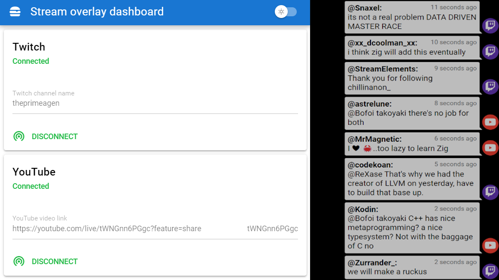

# Streamin utilities
Small set if small utilities for livestreaming!

## Chat overlay

A simple chat overlay for OBS that combines both Twitch and YouTube chat into a single conversation view.



The overlay server runs on port `3000` by default. There are 2 routes available:
- `/chat` - displays the chat overlay
- `/dashboard` - displays the dashboard where you can provide the Twitch channel name and YouTube video link

It's available as a Docker image at [docker.io/xkonti/chat-overlay](https://hub.docker.com/r/xkonti/chat-overlay). It can be run with the following `docker compose` file:

```yaml
version: '3'

services:
  chat-overlay:
    image: xkonti/chat-overlay:latest
    container_name: chat-overlay
    restart: unless-stopped
    ports:
      - 3000:3000
```

or with `docker run`:

```bash
docker run -d -p 3000:3000 xkonti/chat-overlay:latest
```

## Countdown timer

> [!WARNING]
> This is soon to be deprecated as the chat overlay will be expanded to include a countdown timer.

Run 6 minute countdown timer:
```bash
nimble run -- 6
```